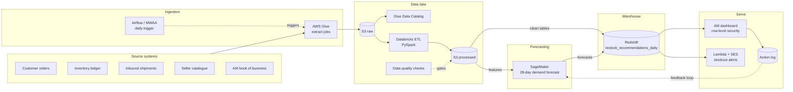
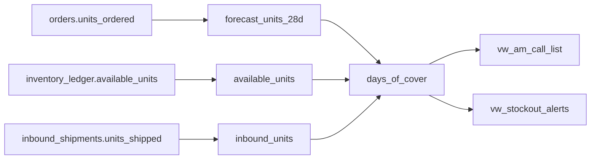

# FBA Stock Health & Early Warning System

A daily forecasting and recommendation product that predicted stock risk across **50k+ FBA seller accounts** and told **600+ EU account managers** what to restock, how much and by when.

| 600+ | 50k+ | 28% | 8 hrs |
|:---:|:---:|:---:|:---:|
| account managers using it every week | FBA seller accounts covered | fewer stockouts in peak season | saved per account manager each week |

---

## Executive summary

| | |
|---|---|
| **Context** | Amazon earns around 35% of the price of every FBA sale, so it only earns when a seller's product is in stock. About 70% of FBA shipments come from sellers manufacturing in China, with roughly 10 days in transit. Restock decisions therefore have to be made well before shelves run low. |
| **Problem** | Each of the 600+ account managers tracked hundreds of sellers through manual spreadsheet checks. Stockouts were usually spotted after sales were lost, while slow-moving stock built up storage costs. |
| **Solution** | Every morning, the product forecasts demand for each SKU, compares it with stock on hand and in transit, and recommends how many units to send and the latest ship-by date. Accounts are ranked by revenue at risk, so account managers call the most urgent sellers first. |
| **Outcome** | Became the default weekly planning tool for EU account management. In peak season it cut stockouts by 28% and saved each account manager 8 hours a week. |

### The balance it optimises

| Too little stock | Too much stock | The right amount |
|---|---|---|
| Lost sales for the seller and lost revenue share for Amazon | Storage fees for the seller and wasted warehouse space for Amazon | Demand met at the lowest cost for both |

---

## My role

**Define**
- Gathered functional and non-functional requirements with account managers and vendors
- Designed the technical architecture and the dataset metadata
- Secured Privacy team approval to process vendor data, confirming no customer PII, performance or safety data was involved

**Build**
- Orchestrated delivery across data engineers (infrastructure) and data scientists (forecasting model)
- Built the ETL in Databricks and the account manager dashboard
- Designed automated row-level security, so each account manager sees only their own sellers

**Launch**
- Led the launch and drove adoption across 600+ account managers
- Ran regular office hours to support users and gather feedback
- Owned the roadmap of improvements after launch

---

## Architecture

A daily batch pipeline: land, clean, forecast, recommend, serve, then learn from what account managers did.



**Security and governance:** Lake Formation and IAM for access, hashed seller IDs, no customer PII.
**Monitoring:** CloudWatch freshness alarms against a 07:00 CET SLA, with SNS alerts to on-call.

---

## Output dataset

`restock_recommendations_daily`, the governed table every dashboard, alert and export reads from.

| Property | Value |
|---|---|
| Owner | EU Data & Analytics (product owner: Hrishikesh Choudhari) |
| Consumers | 600+ EU account managers, ops leadership |
| Grain | Seller account × SKU × marketplace × day |
| Refresh and SLA | Daily batch, available by 07:00 CET |
| Retention | 24 months, for year-on-year seasonality |
| Classification | Confidential. No customer PII; seller IDs hashed |
| Access | Row-level: each AM sees only their own book of accounts |
| Quality checks | Freshness, row-count drift, null keys, stock reconciliation |

<details>
<summary><b>Schema</b></summary>

| Column | Type | Description |
|---|---|---|
| `snapshot_date` | DATE | Date the recommendation was generated |
| `seller_account_key` | STRING | Hashed seller account identifier |
| `sku_id` | STRING | Seller SKU |
| `marketplace` | STRING | UK, DE, FR, IT, ES and other EU stores |
| `category` | STRING | Product category |
| `available_units` | INT | Sellable units in fulfilment centres |
| `inbound_units` | INT | Units shipped but not yet received |
| `forecast_units_28d` | DECIMAL | Expected demand, next 28 days (mean) |
| `forecast_p90_28d` | DECIMAL | High-demand scenario used for safety stock |
| `lead_time_days` | INT | Seller's typical time from order to stock received |
| `days_of_cover` | DECIMAL | How long current stock plus inbound will last |
| `recommended_qty` | INT | Units to send; 0 when stock is healthy |
| `ship_by_date` | DATE | Latest date to ship and avoid a stockout |
| `status` | ENUM | critical, reorder, healthy, excess |
| `priority_score` | DECIMAL | Ranks accounts by revenue at risk, for the AM call list |
| `account_manager_id` | STRING | Owner of the seller relationship; drives row-level access |
| `model_version` | STRING | Forecast version, for audit and drift tracking |

</details>

### Column-level lineage (example: `days_of_cover`)



---

## Metric catalogue

One definition per metric, held in the curated layer so every view agrees.

| Metric | Definition | Why it matters |
|---|---|---|
| Days of cover | (available + inbound) ÷ avg daily forecast | Core health signal for every SKU |
| Stockout risk | days of cover < lead time + safety buffer | Triggers critical and reorder status |
| Recommended qty | forecast over (lead time + coverage) + safety stock − (available + inbound) | Turns insight into an action |
| Safety stock | P90 demand − mean demand over lead time | Protects against demand spikes |
| Sell-through rate | units sold ÷ (units sold + ending stock) | Shows how fast stock moves |
| Excess inventory | units above 90 days of cover | Flags storage cost and removal candidates |
| In-stock rate | % of days a SKU was sellable | Main outcome metric for sellers |
| Forecast accuracy | 1 − WAPE, plus bias | Keeps trust in the recommendations |
| Acceptance rate | recs actioned within 7 days ÷ recs issued | Adoption: does the product change behaviour? |

---

## Business impact (peak season)

- **Adoption:** the default weekly planning tool for EU account management, across 50k+ seller accounts
- **Availability:** 28% fewer stockouts, with risk flagged early enough for sellers to ship stock in time
- **Efficiency:** 8 hours saved per account manager each week, roughly 4,800 hours a week across the team
- **Commercial:** every stockout avoided is a completed sale, and Amazon keeps around 35% of its price

---

## The same pattern, applied to payments

| In this system | In payments infrastructure |
|---|---|
| Forecast demand before stock runs out | Predict payment failures or returns before they reach the customer |
| Recommend a quantity and a ship-by date | Give banks a risk score plus a recommended action |
| Row-level access to each AM's own book | Each bank sees its own data, plus anonymised market benchmarks |
| Acceptance rate and forecast accuracy feedback loop | Monitor model drift and adoption of fraud and scam scores |
| Revenue protected through the cost-share model | A clear value case for each bank, which supports pricing and adoption |

---

## Tech stack

**Data platform:** AWS S3, Glue, Lake Formation, Redshift, Databricks (PySpark)
**Orchestration:** Apache Airflow (MWAA)
**Machine learning:** Amazon SageMaker
**Serving:** BI dashboard with row-level security, AWS Lambda, Amazon SES
**Monitoring:** Amazon CloudWatch, Amazon SNS

---

## Repository contents

```
├── README.md                                           this file
├── index.html                                          interactive portfolio (lineage explorer, dashboard, architecture)
└── Hrishikesh_Choudhari_FBA_Stock_Health_Portfolio.pdf  printable 7-page version
```

To view the interactive version, open `index.html` in a browser, or enable GitHub Pages on this repository.

---

## About this repository

This is a case study of a data product I delivered at Amazon, rebuilt for my portfolio. It contains no Amazon code, data or internal documents. Table names, schemas and architecture are representative, and dashboard figures are illustrative. Impact figures reflect results I reported in my role.

---

**Hrishikesh Choudhari** · London ·
